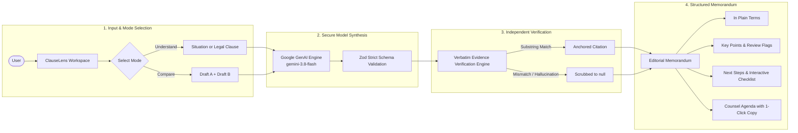
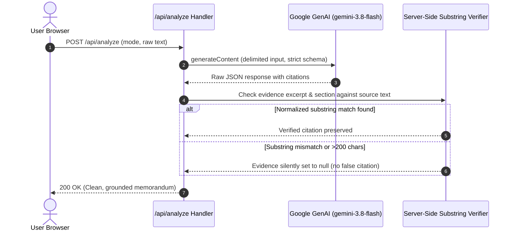
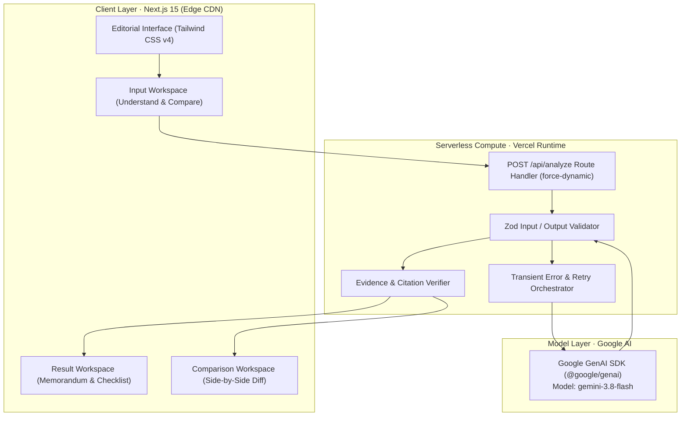
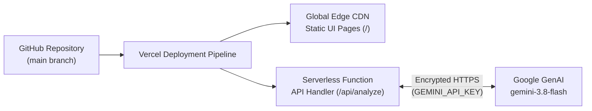

# ClauseLens

<p align="center">
  <strong>Legal information, without the legal complexity.</strong><br>
  <em>An educational comprehension desk that turns opaque contractual language into structured, plain-English memorandums.</em>
</p>

<p align="center">
  
  
  
  
  
  
  
</p>

---

ClauseLens helps individuals and teams turn dense, opaque legal language into clearer, structured information they can understand, evaluate, and discuss with counsel.

Rather than predicting legal outcomes or replacing attorneys, ClauseLens operates as an educational legal comprehension desk: it translates confusing terms into plain language, surfaces critical obligations, verifies every quoted excerpt word-for-word against the source text, and generates targeted questions for consultation with qualified legal professionals.

---

## Capabilities

| Capability | Purpose | Implementation Grounding |
|---|---|---|
| **Understand Mode** | Turn a described situation or pasted clause into structured analysis | Analyzes plain-language circumstances or formal clause syntax |
| **In Plain Terms** | Executive plain-English explanation of core legal mechanics | Synthesized without jargon or legalese |
| **Important Points** | Surface key obligations, surrender conditions, and explicit deadlines | Each point is anchored to verbatim source excerpts |
| **Review Points** | Highlight clauses warranting closer inspection or negotiation | Identifies asymmetric risk, one-sided remedies, or short windows |
| **Verbatim Evidence** | Post-generation source grounding | Evaluates every excerpt against source text via substring verification |
| **Procedural Next Steps** | Actionable, chronological steps prior to executing or responding | Practical guidance (e.g. document condition, retain receipts) |
| **Verification Checklist** | Interactive pre-response clearance checklist | Client-side interactive checklist with real-time toggle states |
| **Counsel Agenda** | Targeted consultation questions for legal counsel | Specific, jurisdiction-sensitive questions with one-click copy |
| **Compare Mode** | Side-by-side comparative analysis of two clause drafts | Identifies substantive variances, bilateral shifts, and financial exposure |

---

## How It Works



### Analysis Pipeline

1. **Input Parsing & Validation**: User inputs are validated client-side and server-side using Zod schemas (`20` to `8,000` characters, strict mode enforcement).
2. **Constrained Prompting**: Prompts enforce neutral, non-definitive phrasing, explicit prohibition against predicting legal outcomes, and strict instruction to quote exact substrings.
3. **Structured Response Synthesis**: Handled via `@google/genai` utilizing native `responseSchema` (OpenAPI definitions with strict property typing).
4. **Independent Evidence Grounding**: The backend inspects every returned `evidence` string and verifies its exact word-for-word presence in the user's submitted text. Quotations that fail matching are scrubbed or marked for transparent user safety.
5. **Transient Failure Recovery**: Built-in bounded retry logic automatically catches transient rate limits (`429`) or temporary service unavailability (`503`) with exponential backoff.

---

## Verbatim Evidence Grounding

To prevent synthetic hallucinations or fabricated legal clauses, ClauseLens applies a dual-layer verification protocol:



- **Situation Mode**: Any quotation is strictly set to `null` server-side because informal situation descriptions do not contain contractual provisions.
- **Document / Compare Mode**: Every quote is normalized (Unicode NFC, typographic quotes, whitespace collapse) and checked against raw text.
- **Fail-Safe Design**: If the AI attempts to paraphrase rather than quote verbatim, the excerpt is nulled rather than presented as authentic source text.

---

## Architecture & Technology Stack



### Core Technologies

- **Framework**: [Next.js 15](https://nextjs.org/) (App Router, React 19)
- **Language**: [TypeScript](https://www.typescriptlang.org/) (strict mode throughout)
- **Styling**: [Tailwind CSS v4](https://tailwindcss.com/) with custom CSS custom properties for editorial print hierarchy
- **Validation**: [Zod 4](https://zod.dev/) for end-to-end schema enforcement
- **GenAI SDK**: [`@google/genai`](https://www.npmjs.com/package/@google/genai) official unified SDK
- **Testing**: [Vitest](https://vitest.dev/) with automated unit and route integration suites

---

## Safety, Boundaries & Legal Posture

ClauseLens is built with strict architectural guardrails:

> [!IMPORTANT]
> **Legal Information Notice**
> ClauseLens provides general informational summaries and educational comprehension assistance only. It does not provide legal advice, legal opinions, statutory representation, or formal contract drafting. Laws and regulations vary widely by jurisdiction. Users must consult a qualified solicitor or attorney for advice on their specific situation.

- **Non-Definitive Phrasing**: Model instructions strictly disallow conclusive predictions (e.g. replacing *"this clause is void"* with *"this clause may be subject to statutory restrictions depending on local law"*).
- **Stateless Privacy**: ClauseLens uses stateless content generation. Document excerpts are processed in-memory for the request duration and are not persisted to a database or user tracking store.
- **Evidence Verification**: Excerpts cited by the model are programmatically cross-referenced against the raw submitted text to prevent synthetic hallucinations.
- **Server-Side Secret Isolation**: API keys are isolated strictly on the server (`process.env.GEMINI_API_KEY`). No sensitive credentials are exposed to the client bundle.

---

## Repository Structure

```
ClauseLens/
├── src/
│   ├── app/
│   │   ├── api/
│   │   │   └── analyze/
│   │   │       ├── route.ts              # POST /api/analyze endpoint with validation & retries
│   │   │       └── __tests__/            # Comprehensive route & retry integration tests
│   │   ├── globals.css                   # Semantic color tokens & typography definitions
│   │   ├── layout.tsx                    # Root layout with editorial font imports
│   │   └── page.tsx                      # Primary single-page application orchestrator
│   ├── components/
│   │   ├── features/
│   │   │   ├── ComparisonWorkspace.tsx   # Side-by-side clause diffs & variance analysis
│   │   │   ├── Disclaimer.tsx            # Contextual statutory disclaimer callouts
│   │   │   ├── HeroSection.tsx           # Product masthead & quick-fill scenario triggers
│   │   │   ├── InputWorkspace.tsx        # Writing surface with draft preservation
│   │   │   ├── ResultWorkspace.tsx       # Plain-language memorandum & interactive checklist
│   │   │   ├── TopicShortcuts.tsx        # Editorial scenario cards
│   │   │   └── TrustSection.tsx          # Operating principles & legal notices
│   │   ├── layout/
│   │   │   ├── SiteNavbar.tsx            # Sticky header with mode switches
│   │   │   └── SiteFooter.tsx            # Colophon and attribution footer
│   │   └── ui/                           # Reusable UI primitives (Button, Card, Badge, etc.)
│   ├── lib/
│   │   ├── content.ts                    # Statutory disclaimer text & preset scenario fixtures
│   │   ├── gemini.ts                     # GenAI client factory with key validation
│   │   ├── prompt.ts                     # System instructions & OpenAPI schemas
│   │   └── utils.ts                      # Class-variance and formatting utilities
│   └── types/
│       └── index.ts                      # TypeScript interfaces and Zod schemas
├── vitest.config.mjs                     # Vitest test runner configuration
├── tsconfig.json                         # Strict TypeScript configuration
└── package.json                          # Package manifest & scripts
```

---

## Getting Started

### Prerequisites

- **Node.js**: `v20.x` or higher
- **Package Manager**: `npm` (v10+)
- **Google AI Studio API Key**: A valid Gemini API key from [Google AI Studio](https://aistudio.google.com/)

### Installation

1. **Clone the repository**:
   ```bash
   git clone https://github.com/tanush326k/ClauseLens.git
   cd ClauseLens
   ```

2. **Install dependencies**:
   ```bash
   npm install
   ```

3. **Configure environment variables**:
   Create a local `.env.local` file based on the example:
   ```bash
   cp .env.example .env.local
   ```
   Add your Gemini API key:
   ```env
   GEMINI_API_KEY=your_actual_gemini_api_key_here
   ```

4. **Launch the development server**:
   ```bash
   npm run dev
   ```
   Open [http://localhost:3000](http://localhost:3000) in your browser.

### Production Deployment

ClauseLens is architected for zero-configuration deployment on platforms like [Vercel](https://vercel.com/):



1. **Import Project**: Connect `https://github.com/tanush326k/ClauseLens` to your Vercel workspace.
2. **Environment Variable**: Under **Project Settings > Environment Variables**, add:
   - `GEMINI_API_KEY`: Your Google AI Studio API key.
3. **Deploy**: Vercel compiles the static pages for sub-second global CDN distribution while running the `/api/analyze` route as an isolated serverless function with complete secret protection.

---

## Verification & Testing

ClauseLens includes automated type checking, linting, and integration test suites:

```bash
# Run unit and integration tests (54 tests covering routes, retries, and schemas)
npm test -- --run

# Run TypeScript type check
npx tsc --noEmit

# Run Next.js linter
npm run lint

# Compile optimized production bundle
npm run build
```

---

## License

This project is licensed under the MIT License — see the [LICENSE](LICENSE) file for details.
